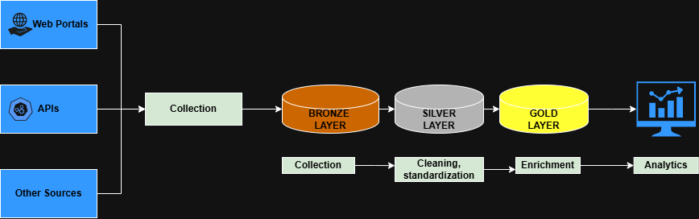

# REMAX WISE AVM
**Automated Valuation Model for Portuguese Real Estate Market**



- **Bronze Layer**: Raw data from sources (Imovirtual, Idealista, etc.)
- **Silver Layer**: Cleaned, validated, schema-standardized data
- **Gold Layer**: Aggregated insights ready for analytics

## Overview

An ETL pipeline that helps real estate investors and analysts make data-driven decisions by collecting and standardizing Portuguese property data from multiple platforms (Imovirtual, Idealista, and others) into a single, analysis-ready format.

**Problem it solves:** Stop manually comparing prices across 10+ real estate websites. This tool automates data collection and gives you clean, unified data for market analysis.

## Who Is This For?

- 📊 **Data analysts** researching Portuguese real estate trends
- 💰 **Investors** looking for undervalued properties
- 🏢 **Agencies** comparing their listings with market prices
- 🔬 **Researchers** studying housing market dynamics

## What You Get

- 🏠 **Unified data** from multiple Portuguese real estate portals
- 🧹 **Cleaned and standardized** property listings (price, location, features, energy certificates)
- 📊 **Analysis-ready format** for trends, deal-breakers detection, and market insights
- 🔄 **Medallion architecture** (Bronze → Silver → Gold layers) for reliable data processing

**Current Status:** Demo scraper for Imovirtual (Lisbon apartment rentals). Full ETL pipeline in development.

---

## Quick Start (for Developers)

> **Important:** The project is under active development. The full ETL pipeline has not yet been implemented.  
> At this stage, a demonstration scraper for a single data source (Imovirtual) is available, as well as the ability to run individual pipeline components (see documentation for details).

These steps demonstrate how to run the demo data scraping process:
```bash
# 1. Clone the repository
git clone https://github.com/Yunnamax/REMAX_WISE_AVM.git
cd REMAX_WISE_AVM

# 2. Create a virtual environment (recommended)
python -m venv venv
source venv/bin/activate  # On Windows: venv\Scripts\activate

# 3. Install dependencies
pip install -r requirements.txt

# 4. Run the demo scraping
# This will collect apartment rental data in Lisbon from Imovirtual
python main.py

# 5. Check the results
# Data will be saved to: data/bronze/imovirtual/{date}/
# Look for Parquet files with property listings
```

---

## Project Structure

The project is organized around the principles of modularity and separation of concerns. The core logic is divided into three data layers with corresponding processing modules.
```
REMAX_WISE_AVM/
├── config/                # Data processing and scraping configurations
├── data/                  # Data storage (local, excluded from git)
│   ├── bronze/            # Raw data from source systems
│   ├── silver/            # Cleaned and standardized data
│   └── gold/              # Aggregated data for analytics
├── docs/                  # Detailed documentation
├── notebooks/             # Exploratory notebooks (analysis, visualization)
├── src/                   # Source code
│   ├── data_pipeline/     # Core ETL pipeline (inter-layer processing)
│   ├── scrapers/          # Data collection modules for each source
│   └── utils/             # Shared utilities and helper functions
└── tests/                 # Tests for all modules
```

---

## Data Pipeline Architecture

The project follows the **Medallion Architecture** with three data quality layers:

1. **Bronze Layer** — Raw data collected from source platforms (Imovirtual, Idealista, etc.)
2. **Silver Layer** — Cleaned, standardized, and validated data with consistent schema
3. **Gold Layer** — Aggregated, enriched data ready for analytics and insights

For detailed architecture documentation, see [docs/architecture.md](docs/architecture.md).

---

## Contributing

The project is under active development, and community contributions are welcome. You can help in the following areas:

### Priority Areas for Contribution

1. **New data sources** — adding scrapers for additional Portuguese real estate portals  
2. **Data quality improvements** — extending validation and handling edge cases  
3. **Documentation** — improving existing documentation or writing new guides  
4. **Testing** — adding unit and integration tests  

### Contribution Process

1. **Discuss changes** — before starting work, open an Issue to discuss the proposed changes  
2. **Create a branch** — from your fork, create a feature branch:
```bash
   git checkout -b feature/your-feature-name
```
3. **Follow coding standards** — ensure your code follows the project's style guidelines
4. **Write tests** — add tests for new functionality
5. **Submit a Pull Request** — describe your changes clearly and reference related issues

---

## License | Confidentiality | Acknowledgements

**License:** MIT — see the [LICENSE](LICENSE.txt) file for details.

**Confidentiality:** This project is intended for educational and research purposes. Users are responsible for compliance with GDPR/LGPD and respecting the terms of service of data sources.

**Acknowledgements:** Portuguese real estate portals and the open-source community.

---

*The project is under active development. Details may change.*